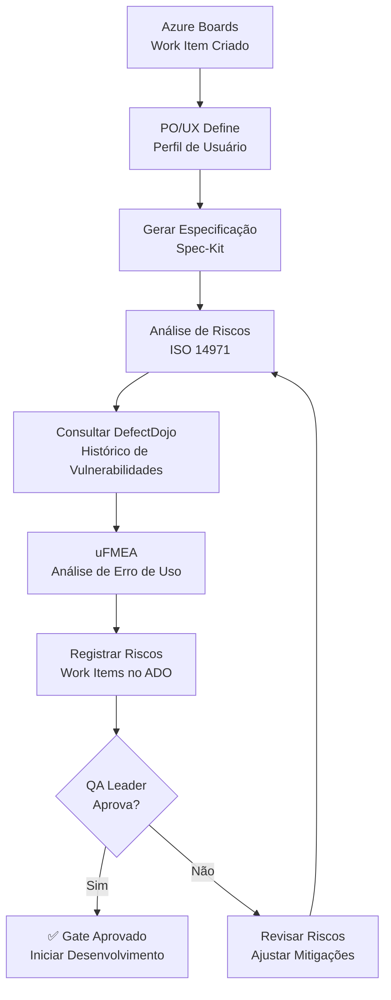
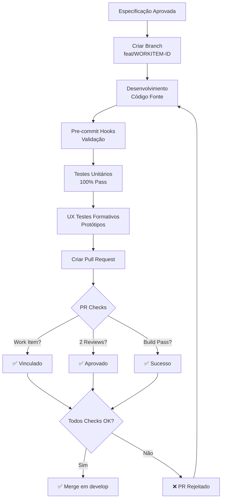
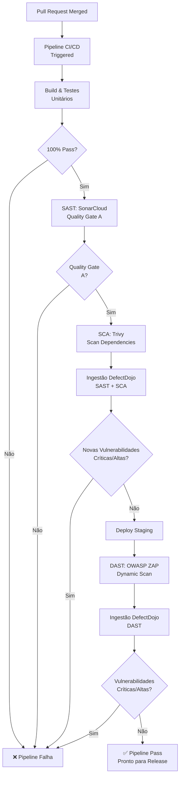
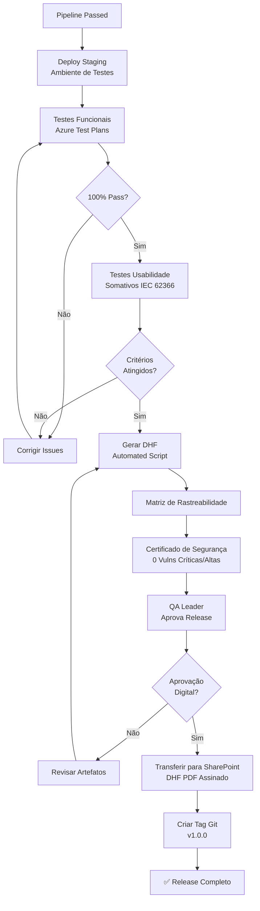
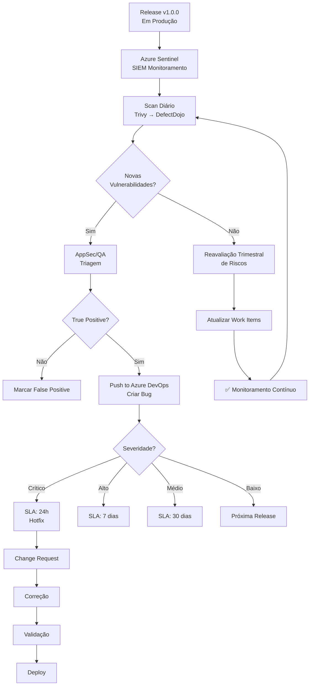
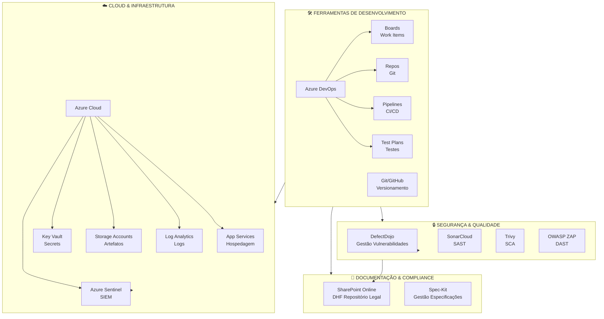

# Diagramas de Fluxo - Mermaid

Este documento contém todos os diagramas Mermaid que visualizam os fluxos do ciclo de vida.

## Fluxo Completo do Ciclo de Vida

```mermaid
flowchart TD
    Start([Início do Projeto]) --> Phase1[FASE 1:<br/>Planejamento, Risco<br/>e Infraestrutura]
    
    Phase1 --> Phase1_1[Azure Boards<br/>Work Item]
    Phase1_1 --> Phase1_2[Spec-Kit<br/>Especificações]
    Phase1_2 --> Phase1_3[Análise de Riscos<br/>ISO 14971]
    Phase1_3 --> Phase1_4[Gate de Aprovação<br/>QA Leader]
    Phase1_4 -->|Aprovado| Phase2[FASE 2:<br/>Desenvolvimento<br/>e Codificação]
    
    Phase2 --> Phase2_1[Git Branch<br/>feat/WORKITEM-ID]
    Phase2_1 --> Phase2_2[Desenvolvimento<br/>Código Fonte]
    Phase2_2 --> Phase2_3[Pre-commit Hooks]
    Phase2_3 --> Phase2_4[Testes Unitários<br/>100% Pass]
    Phase2_4 --> Phase2_5[Pull Request]
    Phase2_5 --> Phase2_6{PR Checks<br/>2 Reviews + Build}
    Phase2_6 -->|Aprovado| Phase2_7[✅ Merge develop]
    Phase2_7 --> Phase3[FASE 3:<br/>Verificação Automatizada<br/>e Ingestão Segurança]
    
    Phase3 --> Phase3_1[Pipeline CI/CD<br/>Azure DevOps]
    Phase3_1 --> Phase3_2[SAST: SonarCloud<br/>Quality Gate A]
    Phase3_2 --> Phase3_3[SCA: Trivy<br/>0 Vulnerabilidades]
    Phase3_3 --> Phase3_4[DefectDojo<br/>Ingestão Automática]
    Phase3_4 --> Phase3_5{Gate Segurança<br/>Vulns Críticas/Altas?}
    Phase3_5 -->|Não| Phase3_11[✅ Pipeline Pass]
    Phase3_11 --> Phase4[FASE 4:<br/>Validação e Liberação<br/>Release]
    
    Phase4 --> Phase4_1[Testes Funcionais<br/>Azure Test Plans]
    Phase4_1 --> Phase4_2[Testes Usabilidade<br/>Somativos IEC 62366]
    Phase4_2 --> Phase4_3[Gerar DHF<br/>Automated Script]
    Phase4_3 --> Phase4_4[Matriz Rastreabilidade]
    Phase4_4 --> Phase4_5[Certificado Segurança<br/>DefectDojo]
    Phase4_5 --> Phase4_6[QA Leader<br/>Aprovação Digital]
    Phase4_6 --> Phase4_7[SharePoint<br/>DHF PDF Assinado]
    Phase4_7 --> Phase4_8[Git Tag<br/>v1.0.0]
    Phase4_8 --> Phase4_9[✅ Release Completo]
    Phase4_9 --> Phase5[FASE 5:<br/>Monitoramento e Gestão<br/>de Vulnerabilidades]
    
    Phase5 --> Phase5_1[Azure Sentinel<br/>SIEM Monitoramento]
    Phase5_1 --> Phase5_2[Scan Diário<br/>Trivy → DefectDojo]
    Phase5_2 --> Phase5_3{Nova<br/>Vulnerabilidade?}
    Phase5_3 -->|Sim| Phase5_4[Triagem AppSec]
    Phase5_4 --> Phase5_5[Push to ADO<br/>Criar Bug]
    Phase5_5 --> Phase5_6[SLA Correção<br/>24h-7d-30d]
    Phase5_3 -->|Não| Phase5_8[✅ Monitoramento Contínuo]
```

## FASE 1: Planejamento, Risco e Infraestrutura

## FASE 2: Desenvolvimento e Codificação

## FASE 3: Verificação Automatizada

## FASE 4: Validação e Liberação

## FASE 5: Monitoramento Pós-Mercado

## Arquitetura de Ativos

---

**Última Atualização**: 2024  
**Formato**: Mermaid Diagram

