# Diagramas de Fluxo - Mermaid

Este documento contém todos os diagramas Mermaid que visualizam os fluxos do ciclo de vida.

## Fluxo Completo do Ciclo de Vida

```mermaid
flowchart TD
    Start([Início do Projeto]) --> Phase1[FASE 1:<br/>Planejamento, Risco<br/>e Infraestrutura]
    
    Phase1 --> Phase1_1[Azure Boards<br/>Work Item]
    Phase1_1 --> Phase1_2[Spec-Kit<br/>Especificações]
    Phase1_2 --> Phase1_3[Análise de Riscos<br/>ISO 14971]
    Phase1_3 --> Phase1_4[Gate de Aprovação<br/>QA Leader]
    Phase1_4 -->|Aprovado| Phase2[FASE 2:<br/>Desenvolvimento<br/>e Codificação]
    
    Phase2 --> Phase2_1[Git Branch<br/>feat/WORKITEM-ID]
    Phase2_1 --> Phase2_2[Desenvolvimento<br/>Código Fonte]
    Phase2_2 --> Phase2_3[Pre-commit Hooks]
    Phase2_3 --> Phase2_4[Testes Unitários<br/>100% Pass]
    Phase2_4 --> Phase2_5[Pull Request]
    Phase2_5 --> Phase2_6{PR Checks<br/>2 Reviews + Build}
    Phase2_6 -->|Aprovado| Phase2_7[✅ Merge develop]
    Phase2_7 --> Phase3[FASE 3:<br/>Verificação Automatizada<br/>e Ingestão Segurança]
    
    Phase3 --> Phase3_1[Pipeline CI/CD<br/>Azure DevOps]
    Phase3_1 --> Phase3_2[SAST: SonarCloud<br/>Quality Gate A]
    Phase3_2 --> Phase3_3[SCA: Trivy<br/>0 Vulnerabilidades]
    Phase3_3 --> Phase3_4[DefectDojo<br/>Ingestão Automática]
    Phase3_4 --> Phase3_5{Gate Segurança<br/>Vulns Críticas/Altas?}
    Phase3_5 -->|Não| Phase3_11[✅ Pipeline Pass]
    Phase3_11 --> Phase4[FASE 4:<br/>Validação e Liberação<br/>Release]
    
    Phase4 --> Phase4_1[Testes Funcionais<br/>Azure Test Plans]
    Phase4_1 --> Phase4_2[Testes Usabilidade<br/>Somativos IEC 62366]
    Phase4_2 --> Phase4_3[Gerar DHF<br/>Automated Script]
    Phase4_3 --> Phase4_4[Matriz Rastreabilidade]
    Phase4_4 --> Phase4_5[Certificado Segurança<br/>DefectDojo]
    Phase4_5 --> Phase4_6[QA Leader<br/>Aprovação Digital]
    Phase4_6 --> Phase4_7[SharePoint<br/>DHF PDF Assinado]
    Phase4_7 --> Phase4_8[Git Tag<br/>v1.0.0]
    Phase4_8 --> Phase4_9[✅ Release Completo]
    Phase4_9 --> Phase5[FASE 5:<br/>Monitoramento e Gestão<br/>de Vulnerabilidades]
    
    Phase5 --> Phase5_1[Azure Sentinel<br/>SIEM Monitoramento]
    Phase5_1 --> Phase5_2[Scan Diário<br/>Trivy → DefectDojo]
    Phase5_2 --> Phase5_3{Nova<br/>Vulnerabilidade?}
    Phase5_3 -->|Sim| Phase5_4[Triagem AppSec]
    Phase5_4 --> Phase5_5[Push to ADO<br/>Criar Bug]
    Phase5_5 --> Phase5_6[SLA Correção<br/>24h-7d-30d]
    Phase5_3 -->|Não| Phase5_8[✅ Monitoramento Contínuo]
```

## FASE 1: Planejamento, Risco e Infraestrutura

```mermaid
flowchart TD
    A[Azure Boards<br/>Work Item Criado] --> B[PO/UX Define<br/>Perfil de Usuário]
    B --> C[Gerar Especificação<br/>Spec-Kit]
    C --> D[Análise de Riscos<br/>ISO 14971]
    D --> E[Consultar DefectDojo<br/>Histórico de Vulnerabilidades]
    E --> F[uFMEA<br/>Análise de Erro de Uso]
    F --> G[Registrar Riscos<br/>Work Items no ADO]
    G --> H{QA Leader<br/>Aprova?}
    H -->|Sim| I[✅ Gate Aprovado<br/>Iniciar Desenvolvimento]
    H -->|Não| J[Revisar Riscos<br/>Ajustar Mitigações]
    J --> D
```

## FASE 2: Desenvolvimento e Codificação

```mermaid
flowchart TD
    A[Especificação Aprovada] --> B[Criar Branch<br/>feat/WORKITEM-ID]
    B --> C[Desenvolvimento<br/>Código Fonte]
    C --> D[Pre-commit Hooks<br/>Validação]
    D --> E[Testes Unitários<br/>100% Pass]
    E --> F[UX Testes Formativos<br/>Protótipos]
    F --> G[Criar Pull Request]
    G --> H{PR Checks}
    H -->|Work Item?| I[✅ Vinculado]
    H -->|2 Reviews?| J[✅ Aprovado]
    H -->|Build Pass?| K[✅ Sucesso]
    I --> L{Todos Checks OK?}
    J --> L
    K --> L
    L -->|Sim| M[✅ Merge em develop]
    L -->|Não| N[❌ PR Rejeitado]
    N --> C
```

## FASE 3: Verificação Automatizada

## FASE 4: Validação e Liberação

## FASE 5: Monitoramento Pós-Mercado

```mermaid
flowchart TD
    A[Release v1.0.0<br/>Em Produção] --> B[Azure Sentinel<br/>SIEM Monitoramento]
    B --> C[Scan Diário<br/>Trivy → DefectDojo]
    C --> D{Novas<br/>Vulnerabilidades?}
    D -->|Sim| E[AppSec/QA<br/>Triagem]
    E --> F{True Positive?}
    F -->|Não| G[Marcar False Positive]
    F -->|Sim| H[Push to Azure DevOps<br/>Criar Bug]
    H --> I{Severidade?}
    I -->|Crítico| J[SLA: 24h<br/>Hotfix]
    I -->|Alto| K[SLA: 7 dias]
    I -->|Médio| L[SLA: 30 dias]
    I -->|Baixo| M[Próxima Release]
    J --> N[Change Request]
    N --> O[Correção]
    O --> P[Validação]
    P --> Q[Deploy]
    D -->|Não| S[Reavaliação Trimestral<br/>de Riscos]
    S --> T[Atualizar Work Items]
    T --> U[✅ Monitoramento Contínuo]
    U --> C
```

## Arquitetura de Ativos

```mermaid
graph TB
    subgraph Cloud["☁️ CLOUD & INFRAESTRUTURA"]
        Azure[Azure Cloud]
        Azure --> AppService[App Services<br/>Hospedagem]
        Azure --> KeyVault[Key Vault<br/>Secrets]
        Azure --> Storage[Storage Accounts<br/>Artefatos]
        Azure --> LogAnalytics[Log Analytics<br/>Logs]
        Azure --> Sentinel[Azure Sentinel<br/>SIEM]
    end
    
    subgraph DevTools["🛠️ FERRAMENTAS DE DESENVOLVIMENTO"]
        ADO[Azure DevOps]
        ADO --> Boards[Boards<br/>Work Items]
        ADO --> Repos[Repos<br/>Git]
        ADO --> Pipelines[Pipelines<br/>CI/CD]
        ADO --> TestPlans[Test Plans<br/>Testes]
        Git[Git/GitHub<br/>Versionamento]
    end
    
    subgraph Security["🔒 SEGURANÇA & QUALIDADE"]
        DefectDojo[DefectDojo<br/>Gestão Vulnerabilidades]
        SonarCloud[SonarCloud<br/>SAST]
        Trivy[Trivy<br/>SCA]
        ZAP[OWASP ZAP<br/>DAST]
    end
    
    subgraph Docs["📄 DOCUMENTAÇÃO & COMPLIANCE"]
        SharePoint[SharePoint Online<br/>DHF Repositório Legal]
        SpecKit[Spec-Kit<br/>Gestão Especificações]
    end
    
    DevTools --> Security
    Security --> DefectDojo
    DevTools --> Cloud
    DevTools --> Docs
    Cloud --> Sentinel
    Security --> SharePoint
```

---

**Última Atualização**: 2024  
**Formato**: Mermaid Diagram

