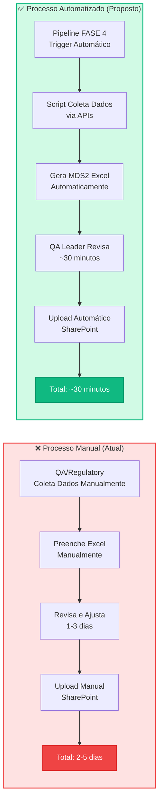
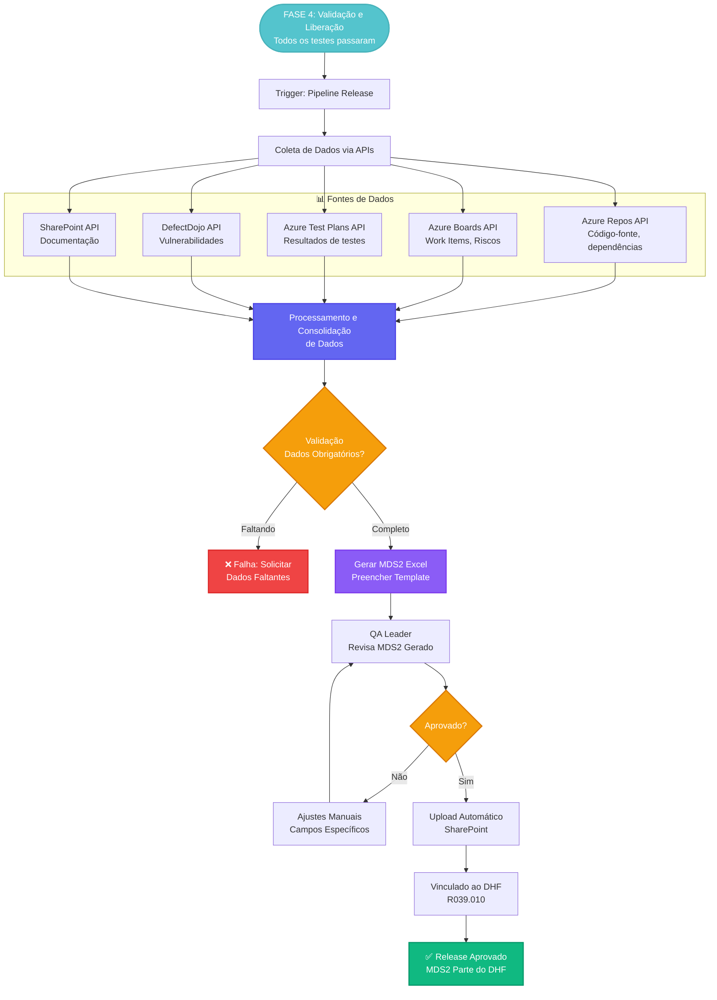
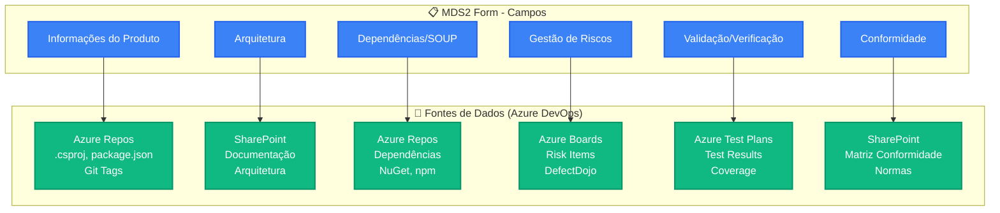
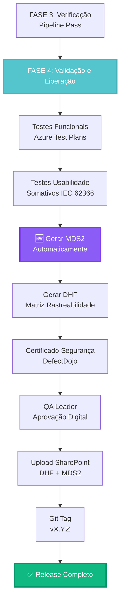
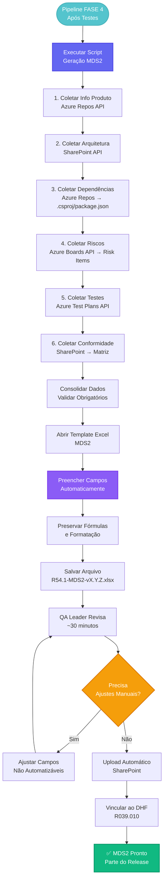

# Análise: Automação do MDS2 Form

**Data**: Dezembro 2025  
**Documento**: R54.1 - MDS2 Form Ionic Health v2 (1).xlsx  
**Objetivo**: Analisar potencial de automação do formulário MDS2 dentro do processo nCommand Lite

---

## ⚠️ Importante - Ambiente do nCommand Lite

Este documento trata da **automação do MDS2 para o produto nCommand Lite real** (Software as a Medical Device).

### Contexto

- **Repositório do Produto**: Azure DevOps (não está neste repositório GitHub)
- **Ferramentas**: Azure DevOps, DefectDojo, SharePoint, etc. (todas na mesma organização Azure DevOps)
- **Dados do Produto**: Existem como qualquer aplicação .NET no Azure DevOps
- **Planilha MDS2**: Está no ambiente completo do nCommand Lite (com todas as ferramentas)

**NÃO está relacionado com**:
- ❌ A aplicação de apresentação (`demo-app/`) deste repositório
- ❌ O projeto de demonstração do processo
- ❌ Qualquer código neste repositório GitHub

**Está relacionado com**:
- ✅ O **produto nCommand Lite real** (SaMD) no Azure DevOps
- ✅ O processo real de desenvolvimento do produto
- ✅ Os dados reais do produto acessíveis via APIs do Azure DevOps

### Automação

O MDS2 será gerado automaticamente a partir dos dados no **Azure DevOps**:
- Repositório do código-fonte (.NET)
- Work Items (requisitos, riscos)
- Test Plans (testes)
- DefectDojo (vulnerabilidades)
- SharePoint (documentação)

---

## 1. Sobre o MDS2

O **MDS2 (Medical Device Software)** é um formulário padrão usado para documentar informações sobre Software as a Medical Device (SaMD). É um documento importante para:

- **Reguladores**: ANVISA, FDA, EMA
- **Certificadores**: Organismos notificados
- **Auditorias**: Evidência de conformidade regulatória
- **Submissões Regulatórias**: Parte da documentação técnica

### 1.1. Conteúdo Típico do MDS2

Baseado em formulários padrão de SaMD, o MDS2 geralmente contém:

1. **Informações do Produto**
   - Nome do produto
   - Versão
   - Classificação (IEC 62304)
   - Uso pretendido

2. **Arquitetura de Software**
   - Componentes principais
   - Diagramas de arquitetura
   - Interfaces

3. **Dependências e SOUP**
   - Bibliotecas de terceiros
   - Frameworks
   - Sistemas operacionais
   - Software Of Unknown Provenance (SOUP)

4. **Gestão de Riscos**
   - Riscos identificados
   - Medidas de mitigação
   - RPN (Risk Priority Number)

5. **Validação e Verificação**
   - Testes realizados
   - Cobertura de testes
   - Resultados de validação

6. **Conformidade Regulatória**
   - Normas aplicáveis
   - Evidências de conformidade

---

## 2. Processo Atual (Estimado)

### 2.1. Quando é Preenchido?

- **FASE 4 (Validação e Liberação)**: Antes do release do produto
- **Submissão Regulatória**: Quando submetido a reguladores
- **Atualizações**: Quando há mudanças significativas no produto

### 2.2. Quem Preenche?

- **QA/Regulatory Affairs**: Principal responsável
- **Desenvolvedores**: Fornecem informações técnicas
- **Arquitetos**: Informações de arquitetura

### 2.3. Tempo Estimado

- **Preenchimento Manual**: 1-3 dias
- **Revisão**: 1-2 dias
- **Total**: 2-5 dias por versão

---

## 3. Dados Disponíveis no Ambiente nCommand Lite

⚠️ **IMPORTANTE**: O MDS2 será gerado a partir dos dados do **produto nCommand Lite real no Azure DevOps**.

O ambiente nCommand Lite completo (Azure DevOps + ferramentas integradas) já possui toda a informação necessária para preencher o MDS2:

### 3.1. Informações do Produto

| Campo MDS2 | Fonte no Azure DevOps (Produto Real) |
|------------|--------------------------------------|
| Nome do Produto | Azure Repos → Arquivos do projeto (.csproj, package.json) |
| Versão | Git Tags no Azure Repos, versão nos arquivos de projeto |
| Classificação IEC 62304 | Documentação no SharePoint → Class B |
| Uso Pretendido | Azure Boards → Work Items (Features/Epics) → Input Data |

### 3.2. Arquitetura de Software

| Campo MDS2 | Fonte no Azure DevOps (Produto Real) |
|------------|--------------------------------------|
| Componentes Principais | SharePoint → Documentação técnica (C4, ADRs) |
| Diagramas | SharePoint → Documentação de arquitetura |
| Interfaces | SharePoint → SRS, Documentação de API |
| Estrutura de Projetos | Azure Repos → Estrutura de pastas, .csproj files |

### 3.3. Dependências e SOUP

| Campo MDS2 | Fonte no Azure DevOps (Produto Real) |
|------------|--------------------------------------|
| Bibliotecas JavaScript | Azure Repos → `package.json` → `dependencies` |
| Bibliotecas .NET | Azure Repos → `*.csproj` → `<PackageReference>` |
| Frameworks | Azure Repos → `.csproj` → `<TargetFramework>` |
| Versões | Azure Repos → Arquivos de dependência (package.json, .csproj) |
| Licenças | Análise automática via API (NuGet, npm) |

### 3.4. Gestão de Riscos

| Campo MDS2 | Fonte no Azure DevOps (Produto Real) |
|------------|--------------------------------------|
| Riscos Identificados | Azure Boards API → Risk Work Items |
| RPN | Azure Boards API → Campos customizados (Severity × Probability × Detectability) |
| Mitigações | Azure Boards API → Work Items vinculados (Mitigates) |
| Status | DefectDojo API → Vulnerabilidades, Azure Boards → Status dos riscos |

### 3.5. Validação e Verificação

| Campo MDS2 | Fonte no Azure DevOps (Produto Real) |
|------------|--------------------------------------|
| Testes Unitários | Azure Test Plans API → Test Runs, Relatórios de testes |
| Testes de Integração | Azure Test Plans API → Test Suites |
| Testes E2E | Azure Pipelines → Artefatos de Playwright, Azure Test Plans |
| Cobertura de Código | Azure Pipelines → SonarCloud reports (artefatos) |
| Testes de Segurança | DefectDojo API → Findings (SAST/SCA/DAST) |

### 3.6. Conformidade Regulatória

| Campo MDS2 | Fonte no Azure DevOps / SharePoint |
|------------|------------------------------------|
| Normas Aplicáveis | SharePoint → Documentação de conformidade |
| Evidências | SharePoint → Links para documentação, testes, registros |
| Certificações | SharePoint → Documentação de certificação |
| Matriz de Conformidade | SharePoint → Design History File (R039.010) |

---

## 4. Proposta de Automação

### 4.1. Estratégia de Automação

**Objetivo**: Gerar automaticamente o MDS2 Form a partir dos dados do ambiente nCommand Lite no Azure DevOps.

#### Fase 1: Coleta de Dados

O processo de automação coletará dados de múltiplas fontes via APIs:

1. **Informações do Produto**:
   - Azure Repos API → Arquivos do projeto (.csproj, package.json)
   - Git API → Tags de versão
   - SharePoint → Documentação de classificação

2. **Arquitetura**:
   - SharePoint API → Documentação técnica
   - Azure Repos → Estrutura de projetos

3. **Dependências (SOUP)**:
   - Azure Repos API → Arquivos de dependência (.csproj, package.json)
   - Análise de licenças via APIs de repositórios (NuGet, npm)

4. **Riscos**:
   - Azure Boards API → Risk Work Items
   - DefectDojo API → Vulnerabilidades de segurança

5. **Testes**:
   - Azure Test Plans API → Resultados de testes
   - Azure Pipelines → Artefatos de relatórios (cobertura, E2E)

6. **Conformidade**:
   - SharePoint API → Matriz de conformidade
   - Documentação de normas aplicáveis

#### Fase 2: Geração do Formulário

Gerar MDS2 em formato Excel a partir do template:

- Abrir template Excel da planilha MDS2
- Preencher campos automaticamente com dados coletados
- Preservar fórmulas e cálculos do template original
- Salvar nova versão com versão do produto no nome

#### Fase 3: Integração com Pipeline

Adicionar etapa no pipeline de release do Azure DevOps:

- Executar script de geração do MDS2
- Gerar arquivo Excel preenchido
- Upload automático para SharePoint (DHF)
- Referenciar no Design History File (R039.010)

### 4.2. Pontos de Integração

#### Integração no Ciclo de Vida

```
FASE 4: Validação e Liberação
    ↓
Gerar MDS2 Automaticamente
    ↓
Validar/Revisar (QA Leader)
    ↓
Salvar no SharePoint (DHF)
    ↓
Release
```

#### Integração com DHF (R039.010)

- MDS2 gerado automaticamente
- Vinculado ao Design History File
- Upload automático para SharePoint

### 4.3. Processo de Geração

**Fluxo de Automação**:

1. **Trigger**: Pipeline de release do Azure DevOps (FASE 4)

2. **Coleta de Dados** (via APIs):
   - Consultar Azure Repos para informações do projeto e dependências
   - Consultar Azure Boards para requisitos e riscos
   - Consultar Azure Test Plans para resultados de testes
   - Consultar DefectDojo para vulnerabilidades
   - Consultar SharePoint para documentação

3. **Processamento**:
   - Consolidar dados coletados
   - Calcular métricas (RPN, cobertura de testes, etc.)
   - Validar dados obrigatórios

4. **Geração**:
   - Abrir template Excel do MDS2
   - Preencher campos com dados coletados
   - Preservar fórmulas e formatação do template
   - Salvar arquivo com versão do produto

5. **Validação**:
   - QA Leader revisa MDS2 gerado
   - Ajustes manuais se necessário (campos não automatizáveis)

6. **Armazenamento**:
   - Upload para SharePoint (DHF)
   - Vinculação ao Design History File (R039.010)
   - Versionamento junto com o release

---

## 5. Benefícios da Automação

### 5.1. Eficiência

- ✅ **Redução de Tempo**: De 2-5 dias → ~30 minutos (geração + revisão)
- ✅ **Eliminação de Erros**: Dados sempre atualizados e consistentes
- ✅ **Rastreabilidade**: Dados vinculados às fontes originais

### 5.2. Conformidade

- ✅ **Sempre Atualizado**: MDS2 gerado automaticamente em cada release
- ✅ **Consistência**: Mesmo formato, mesma estrutura
- ✅ **Evidências**: Links diretos para fontes de dados

### 5.3. Manutenibilidade

- ✅ **Versionamento**: MDS2 versionado junto com o produto
- ✅ **Histórico**: Histórico completo de mudanças
- ✅ **Auditoria**: Rastreabilidade completa

---

## 6. Próximos Passos

### 6.1. Análise da Planilha

**Necessário**:

1. Abrir a planilha Excel `R54.1 - MDS2 Form Ionic Health v2 (1).xlsx`
2. Identificar:
   - Estrutura das abas
   - Campos que podem ser preenchidos automaticamente
   - Campos que requerem input manual
   - Cálculos e fórmulas

### 6.2. Mapeamento de Campos

Criar mapeamento detalhado:

| Campo MDS2 | Tipo | Fonte Automática | Requer Manual? |
|------------|------|------------------|----------------|
| Nome do Produto | Texto | package.json | ❌ |
| Versão | Texto | Git Tag | ❌ |
| ... | ... | ... | ... |

### 6.3. Implementação

1. **Criar Template**: Excel template com estrutura do MDS2
2. **Script de Geração**: Python script para coletar e preencher dados
3. **Integração Pipeline**: Adicionar ao pipeline de release
4. **Validação**: QA Leader revisa e aprova
5. **Upload**: Upload automático para SharePoint

---

## 7. Exemplo de Implementação

### 7.1. Estrutura de Artefatos

**No Azure DevOps / SharePoint**:

- **Template MDS2**: Armazenado no SharePoint como template base
- **Script de Geração**: No repositório do projeto (Azure Repos)
- **MDS2 Gerado**: 
  - SharePoint → Design History File (R039.010)
  - Estrutura: `DHF/[Produto]/v[Versão]/R54.1-MDS2-v[Versão].xlsx`
- **Histórico**: Todas as versões do MDS2 versionadas e rastreáveis

### 7.2. Integração com Pipeline

**Localização no Pipeline**: FASE 4 (Validação e Liberação)

**Etapas do Processo**:

1. **Pré-requisitos**:
   - Build bem-sucedido
   - Testes passaram
   - Validações concluídas

2. **Geração do MDS2**:
   - Executar script de automação
   - Coletar dados via APIs do Azure DevOps
   - Gerar Excel preenchido

3. **Revisão**:
   - QA Leader revisa MDS2 gerado
   - Aprova ou solicita ajustes

4. **Upload**:
   - Upload automático para SharePoint
   - Vinculação ao DHF (R039.010)

5. **Release**:
   - MDS2 aprovado é parte do release
   - Versionamento e rastreabilidade garantidos

---

## 8. Requisitos para Implementação

### 8.1. Requisitos Técnicos

**Ferramentas Necessárias**:
- Script para automação (Python, PowerShell, ou similar)
- Biblioteca para manipulação de Excel (openpyxl, EPPlus, etc.)
- Acesso às APIs do Azure DevOps
- Acesso ao SharePoint

### 8.2. Acesso a APIs

**APIs Necessárias**:
- **Azure DevOps REST API**: 
  - Work Items (requisitos, riscos)
  - Test Plans (resultados de testes)
  - Repos (código-fonte, dependências)
  - Builds (versões, artefatos)
- **SharePoint API**: 
  - Documentação
  - Templates
  - Upload de arquivos
- **DefectDojo API**: 
  - Vulnerabilidades (opcional, se disponível)

### 8.3. Template Excel

- Template do MDS2 (planilha original) armazenado no SharePoint
- Campos identificados e mapeados para fontes de dados
- Fórmulas e cálculos do template preservados na geração

---

## 9. Diagramas do Processo

### 9.1. Processo Atual (Manual) vs Processo Automatizado



### 9.2. Fluxo Completo de Automação do MDS2



### 9.3. Mapeamento de Dados: MDS2 ↔ Fontes no Azure DevOps



### 9.4. Integração no Ciclo de Vida (FASE 4)



### 9.5. Detalhamento do Processo de Geração



---

## 10. Conclusão

O **MDS2 Form** é um excelente candidato para automação dentro do processo nCommand Lite porque:

1. ✅ **Dados já disponíveis**: Toda informação necessária já existe no ecossistema
2. ✅ **Processo repetitivo**: Preenchido em cada release
3. ✅ **Alto valor**: Documento regulatório importante
4. ✅ **Redução significativa de tempo**: De dias para minutos

**Recomendação**: Prosseguir com análise detalhada da planilha e implementação do script de geração automática.

---

**Próximo Passo**: Analisar a estrutura real da planilha Excel para mapear campos específicos e criar o script de automação.

---

**Última Atualização**: Dezembro 2025  
**Status**: ⏳ Aguardando análise da planilha

