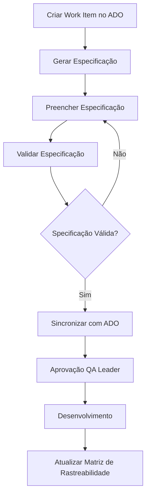

# Implementação do Spec-Kit - Resumo Executivo

**Data**: 2024  
**Versão**: 1.0.0  
**Status**: Implementado

## Visão Geral

O Spec-Kit foi implementado para gerenciar o processo de planejamento do ciclo de vida e infraestrutura do desenvolvimento do nCommand Lite, garantindo rastreabilidade, conformidade regulatória e integração com o processo estabelecido.

## Objetivos Alcançados

✅ **Gestão de Especificações Técnicas**
- Templates padronizados para diferentes tipos de especificações
- Validação automática de estrutura e conteúdo
- Rastreabilidade completa

✅ **Integração com Processo Regulatório**
- Conformidade com IEC 62304, ISO 13485, IEC 62366-1
- Integração com SOPs estabelecidos
- Suporte a análise de riscos (ISO 14971)

✅ **Automação**
- Geração automática de especificações
- Sincronização com Azure DevOps
- Geração de matriz de rastreabilidade

## Componentes Implementados

### 1. Templates de Especificação

| Template | Descrição | Conformidade |
|----------|-----------|--------------|
| `feature-spec.md` | Especificação de features funcionais | IEC 62304, ISO 13485 |
| `api-spec.md` | Especificação de APIs REST | ISO 13485 |
| `infrastructure-spec.md` | Especificação de infraestrutura (IaC) | ISO 13485, ISO 27001 |
| `usability-spec.md` | Especificação de usabilidade | IEC 62366-1 |

### 2. Ferramentas de Automação

| Ferramenta | Linguagem | Função |
|------------|-----------|--------|
| `generate-spec.sh` | Bash | Gera especificações a partir de templates |
| `sync-ado.py` | Python | Sincroniza com Azure DevOps (Work Items) |
| `traceability.py` | Python | Gera matriz de rastreabilidade |
| `validate-spec.sh` | Bash | Valida estrutura e conteúdo |

### 3. Estrutura de Diretórios

```
spec-kit/
├── templates/          # Templates Markdown
├── tools/              # Ferramentas de automação
├── scripts/            # Scripts auxiliares
├── specs/              # Especificações geradas
│   ├── features/
│   ├── api/
│   ├── infrastructure/
│   └── usability/
├── README.md           # Documentação principal
├── USAGE.md            # Guia de uso
├── CHANGELOG.md        # Histórico de mudanças
└── requirements.txt    # Dependências Python
```

## Integração com Processo

### FASE 1: Planejamento, Risco e Infraestrutura

O Spec-Kit suporta diretamente a FASE 1:

1. **Gestão de Demanda**: Especificações geradas a partir de Work Items
2. **Análise de Risco**: Templates incluem seção de análise de riscos (ISO 14971)
3. **Usabilidade**: Template dedicado para especificação de usabilidade (IEC 62366-1)
4. **Gate de Aprovação**: Validação automática antes da aprovação

### Rastreabilidade

- Requisitos → Especificações → Código → Testes
- Vinculação automática com Azure DevOps
- Matriz de rastreabilidade gerada automaticamente

### Conformidade Regulatória

Todos os templates incluem seções para:

- **ISO 13485**: Controle de documentos, rastreabilidade
- **IEC 62304**: Processo de desenvolvimento, classificação
- **IEC 62366-1**: Engenharia de usabilidade, análise de erro de uso
- **ISO 14971**: Análise de riscos, RPN, mitigação

## Fluxo de Uso



## Funcionalidades Principais

### Geração de Especificações

```bash
./spec-kit/tools/generate-spec.sh \
  --type feature \
  --workitem USER-123 \
  --title "Nova Feature" \
  --author "Nome do Autor"
```

### Validação

```bash
./spec-kit/scripts/validate-spec.sh spec-kit/specs/features/USER-123-feature-spec.md
```

### Sincronização com Azure DevOps

```bash
./spec-kit/tools/sync-ado.py \
  --spec spec-kit/specs/features/USER-123-feature-spec.md \
  --organization ionic-health \
  --project nCommand-Lite
```

### Rastreabilidade

```bash
./spec-kit/tools/traceability.py \
  --specs-dir spec-kit/specs \
  --output docs/traceability-matrix.md
```

## Benefícios

1. **Padronização**: Templates consistentes para todas as especificações
2. **Automação**: Redução de trabalho manual na criação e manutenção
3. **Rastreabilidade**: Vinculação automática entre requisitos, código e testes
4. **Conformidade**: Garantia de conformidade regulatória desde o início
5. **Integração**: Integração nativa com Azure DevOps e processo estabelecido

## Próximos Passos

### Melhorias Futuras

- [ ] Integração com SonarCloud para rastreabilidade de código
- [ ] Exportação automática de especificações para PDF
- [ ] Integração com Azure Test Plans
- [ ] Dashboard de rastreabilidade visual
- [ ] Validação de conformidade automatizada

### Manutenção

- Revisão trimestral dos templates
- Atualização conforme mudanças regulatórias
- Melhorias baseadas em feedback do time

## Referências

- **Documentação do Spec-Kit**: `spec-kit/README.md`
- **Guia de Uso**: `spec-kit/USAGE.md`
- **Processo Integrado**: `docs/PROCESS.md`
- **SOPs**: `docs/sop/`

## Aprovação

✅ **QA Leader**: [Aguardando aprovação]  
✅ **Tech Lead**: [Aguardando aprovação]

---

**Implementado por**: Auto (AI Assistant)  
**Data**: 2024  
**Versão**: 1.0.0

